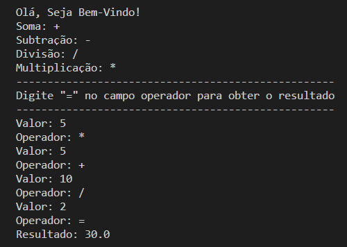

<h1> Calculadora </h1>

Calculadora criada usando a linguagem Python.

<hr>

### 👨‍💻 Preview

<br>

<hr>

### 📌 Features

- [x] Soma
- [x] Subtração
- [x] Multiplicação
- [x] Divisão
- [ ] Potência
- [ ] Raiz Quadrada

<br>
<hr>

### 🔧 Pré-Requisitos

Antes de começar você precisará ter instalado o [Python](https://www.python.org/downloads/), [Git](https://git-scm.com/downloads), e uma IDE para trabalhar com o código ex.: [VS Code](https://code.visualstudio.com/download) ou [PyCharm](https://www.jetbrains.com/pt-br/pycharm/download/#section=windows)

```bash
#Abra o git bash e clone o repositório usando o link abaixo
$ git clone https://github.com/JailtonArauj0/calculadora

#Abra sua IDE e execute o projeto 
$ python3 calculadora.py
```
<br>
<hr>

### ⚙️ Tecnologias utilizadas

- Python
<br>
<hr>

### ✏️ Autor

<br>
<br>
<a href="https://github.com/JailtonArauj0">Jailton Araújo</a>

<br>

[](https://www.linkedin.com/in/jailton-araujo/)

<hr>


⚠️ Projeto em construção ⚠️